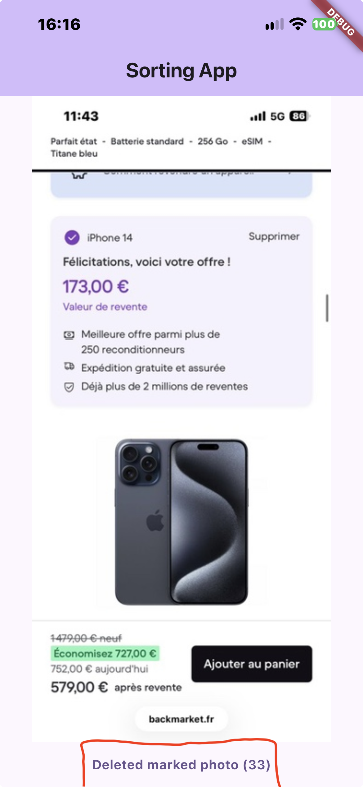

# Screenshot Sorter

A simple iOS app (Flutter) to clean up the screenshots you take by accident and never delete. It shows your screenshots one at a time: swipe to keep, swipe to delete.

<p align="center">
  
  
  
</p>

## Features

- Reads the **Screenshots** album of your photo library (with permission).
- **Swipe left** to keep a photo, **swipe right** to mark it for deletion.
- **Batch deletion**: marked photos are deleted all at once from the bottom button, with a single iOS confirmation. iOS does not allow apps to skip this confirmation, and deleted photos stay in "Recently Deleted" for 30 days.
- **Persistent state**: marked photos and your last position survive closing the app. You resume where you stopped, even if you have thousands of screenshots.
- **Lazy loading**: photos are loaded 10 at a time and the next page is fetched before you reach the end, so the app stays fast with large libraries.

## Tech stack

- [Flutter](https://flutter.dev) / Dart
- [`photo_manager`](https://pub.dev/packages/photo_manager) and `photo_manager_image_provider` for library access and thumbnails
- [`shared_preferences`](https://pub.dev/packages/shared_preferences) for local persistence

## How it works

- The current photo is tracked by an index in a list loaded page by page. The next page is requested when fewer than 3 photos remain.
- A loading flag prevents duplicate page requests when swiping quickly.
- To resume after a restart, the app saves the **creation date** of the last viewed photo, not its index (an index shifts when photos are deleted). On launch, the album is filtered to photos created up to that date.
- Marked photo ids are stored locally. After a deletion, only the ids that were actually deleted are removed from the list, so cancelling the iOS prompt loses nothing.

## Getting started

Requirements: Flutter SDK, Xcode, an iPhone (the photo library is easier to test on a real device).

```bash
git clone https://github.com/rayene00/sorting_app.git
cd YOUR_REPO
flutter pub get
open ios/Runner.xcworkspace   # select your Apple ID team under Signing & Capabilities
flutter run -d <your-iphone-id>
```

The photo library permission text is defined by `NSPhotoLibraryUsageDescription` in `ios/Runner/Info.plist`.

## Known limitations

- Tested on iOS only.
- The album is found by its English name ("Screenshots"), so it will not be found on an iPhone set to another language.
- If the permission is denied, the app shows no photos (proper handling is planned).

## Roadmap

- [ ] Handle denied or limited photo permission
- [ ] Identify the Screenshots album in a language-independent way
- [ ] Undo the last swipe
- [ ] Remove duplicate marks and add tests

## What I learned

First Flutter project: state management with `setState`, async/await, pagination, local persistence, and working with native iOS permissions.